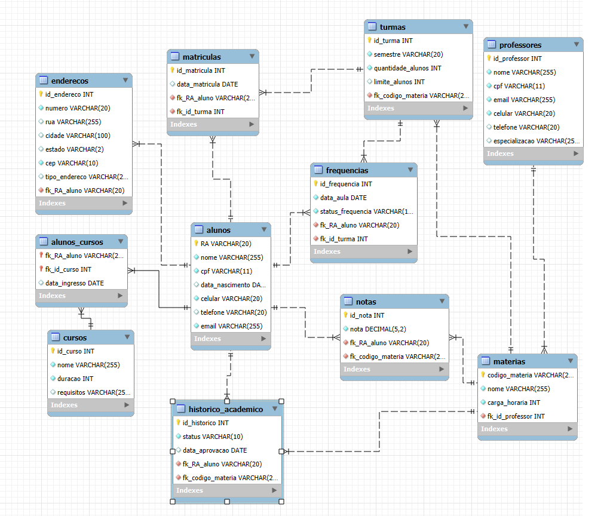

# 🎓 Sistema de Gerenciamento Acadêmico - Banco de Dados

Este projeto apresenta a modelagem e implementação de um banco de dados relacional para uma universidade, com foco no gerenciamento completo de informações acadêmicas.

## 🧩 Funcionalidades

- Cadastro de alunos, professores, cursos e matérias.
- Suporte a múltiplos cursos por aluno.
- Registro de turmas, matrículas, notas, frequências e histórico acadêmico.
- Endereçamento separado e estruturado para alunos.
- Relacionamentos normalizados com uso de chaves primárias e estrangeiras.

## 🗄️ Estrutura do Banco de Dados

### Modelo Entidade-Relacionamento

- **Alunos** com RA como chave primária, podendo se matricular em múltiplos cursos.
- **Professores** responsáveis por matérias, não por turmas.
- **Matérias** com código único e professor responsável.
- **Turmas** relacionadas às matérias e contendo os alunos matriculados.
- **Notas**, **Frequências** e **Histórico Acadêmico** relacionados às matérias e alunos.
- **Endereços** armazenados em tabela separada, associados ao RA do aluno.

  
## 📐 Modelo Lógico em SQL

